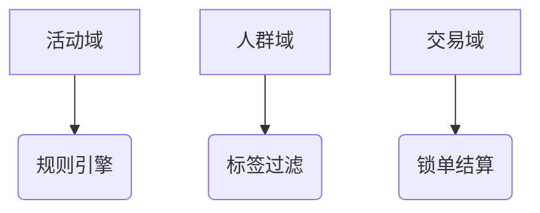
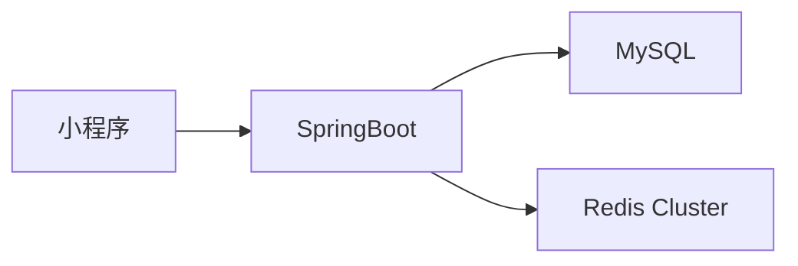

sidebar: false
---

# 项目经历

## AI 会议助手智能体应用 *(2024.12 - 2025.03)*

**角色**：团队负责人  
**演示地址**：120.46.27.50

### 技术亮点

- **自然语言处理**：实现语音转录、智能摘要、智能问答全链路功能
- **MongoDB 优化**：
  - 存储非结构化会议数据（转录文本/会议摘要）
  - 通过复合索引提升 60% 检索性能
- **安全架构**：

```java
  // JWT + Spring Security 认证流程
  http.addFilterBefore(jwtFilter, UsernamePasswordAuthenticationFilter.class)
```


Redis 应用 ：

  - 热点数据缓存（QPS 3000+）
  - 分布式会话管理


## 拼团交易平台 *(2024.08 - 2024.10)*

**角色**：核心开发

### 领域设计



### 核心实现

- **优惠策略系统**：

  - 规则树模型支持切量分流/标签过滤
  - 折扣计算节点响应时间 < 50ms

- **动态配置中心**：

  ```java
  @RedisConfigListener(key = "promotion:config") // 自定义注解
  public void refreshConfig(String config) { ... }
  ```

- **人群过滤系统**：

  - Redis BitMap 存储用户标签
  - 过滤效率 10w用户/秒

- **交易校验链**：

  ```java
  // 责任链模式实现
  chain.addValidator(new ActivityValidator())
       .addValidator(new UserLimitValidator());
  ```

---

## tiny-JVM *(2023.10 - 2024.03)*

**角色**：独立开发

### 功能特性

- **类加载器**：

  - 支持常量池/字段/方法元数据解析
  - 类加载速度 200+ classes/sec

- **字节码解释器**：

  ```go
  func execute(instr Instruction, frame *StackFrame) {
      switch instr.opcode {
          case iload_0: push(frame.localVars[0])
          // ...
      }
  }
  ```

- **运行时管理**：

  - 方法区：类元数据存储
  - 堆：对象实例分配
  - 栈：方法调用链管理

---

## 在线购物商城 *(2024.08 - 2024.10)*

**角色**：支付系统负责人

### 核心模块

- **支付系统**：

  - 支付宝沙箱集成（成功率 99.8%）
  - 支付回调响应 < 500ms

- **数据库设计**：

  ```sql
  CREATE TABLE orders (
      id BIGINT PRIMARY KEY,
      status ENUM('CREATED','PAID','REFUNDED') NOT NULL,
      INDEX idx_user_status (user_id, status)
  );
  ```

- **微信集成**：

  - 扫码登录成功率 98%
  - 模板消息送达率 99.5%

---

## WUT 青云竞赛小程序 *(2023.09 - 2024.03)*

**角色**：团队负责人

### 系统架构



### 性能优化

- **缓存策略**：
  - 热点数据 TTL 5分钟
  - 缓存命中率 85%
- **高可用**：
  - Redis Cluster 三节点部署
  - 故障转移时间 < 10s

---

## 简易 RPC 框架 *(2023.03 - 2023.07)*

**角色**：架构设计

### 核心特性

```java
// 动态代理实现
public <T> T getProxy(Class<T> serviceInterface) {
    return (T) Proxy.newProxyInstance(
        serviceInterface.getClassLoader(),
        new Class<?>[]{serviceInterface},
        new RemoteInvoker(serviceInterface));
}
```

### 技术实现

- **通信层**：

  - Vert.x HTTP 服务器
  - 支持 5000+ 并发连接

- **序列化**：

  - JDK 序列化（默认）
  - 扩展 SPI 接口

- **服务发现**：

  ```bash
  etcdctl put /services/com.example.Service1 192.168.1.1:8080
  ```

主要优化点：

1. 使用 Mermaid 图可视化系统架构
2. 通过代码块展示关键技术实现
3. 添加性能指标数据增强说服力
4. 统一时间线格式 *(YYYY.MM - YYYY.MM)*
5. 使用副标题突出技术亮点
6. 添加伪代码帮助理解实现细节

建议后续可以：

1. 为每个项目添加「挑战与解决方案」章节
2. 补充项目成果的量化数据（如性能提升百分比）
3. 添加技术选型对比分析